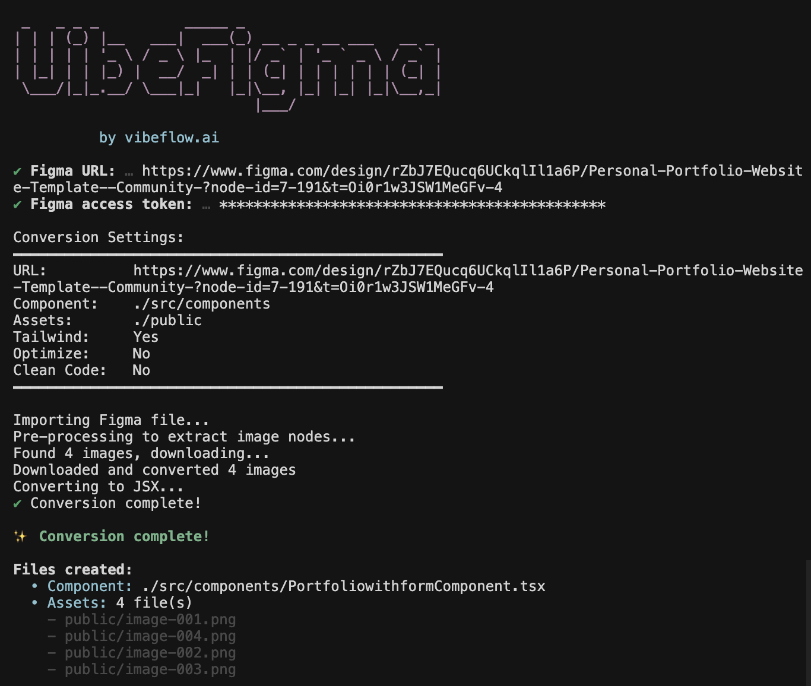

# VibeFigma - Figma to React Converter

Transform your Figma designs into production-ready React components with Tailwind CSS automatically.

<div align="center">
  
</div>

## Quick Start

VibeFigma can be used in multiple ways:

## Claude Code Skill

For Claude Code, install the skill to enable Figma to React conversion directly within your Claude Code environment.

```sh
npx npx skills add vibeflowing-inc/vibe_figma --skill vibefigma
```

### 2. Using our CLI (Interactive - Easiest!)

```bash
npx vibefigma --interactive
```

The CLI will guide you through:
- Entering your Figma URL
- Providing your access token
- Choosing output paths

### 3. Direct Command (Fast)

```bash
npx vibefigma "https://www.figma.com/design/4i8Tp5btFPRqtkYXplnfT6/50-Web-Sign-up-log-in-designs--Community-?node-id=26-2944&t=d8ZfhZOwcLuUz0Jz-4" --token YOUR_TOKEN
```

### 3. Using Environment Variable

Set your Figma token once:

```bash
export FIGMA_TOKEN=your_figma_access_token
npx vibefigma "https://www.figma.com/design/4i8Tp5btFPRqtkYXplnfT6/50-Web-Sign-up-log-in-designs--Community-?node-id=26-2944&t=d8ZfhZOwcLuUz0Jz-4"
```

### 🔑 Getting a Figma Access Token

1. Go to [Figma Account Settings](https://www.figma.com/settings)
2. Scroll to **Personal Access Tokens**
3. Click **Generate new token**
4. Give it a name and click **Generate**
5. Copy the token (you won't see it again!)
6. Store it securely in a `.env` file or pass via `--token` flag


## Features

- **Official Figma API Integration** - Direct integration with Figma's API for accurate design extraction
- **React Component Generation** - Convert Figma frames to React/TypeScript components
- **Tailwind CSS Support** - Automatic Tailwind class generation (enabled by default)
- **Code Optimization** - Optional AI-powered code cleanup

## Advanced Usage

### Basic Usage

```bash
# Convert a Figma design to React component
npx vibefigma "https://www.figma.com/design/4i8Tp5btFPRqtkYXplnfT6/50-Web-Sign-up-log-in-designs--Community-?node-id=26-2944&t=d8ZfhZOwcLuUz0Jz-4"
```

### Custom Output Paths

```bash
# Save to specific directory
npx vibefigma [url] -c ./src/components -a ./public/assets

# Save to specific file
npx vibefigma [url] -c ./src/components/Hero.tsx
```

### Disable Tailwind CSS

```bash
# Generate regular CSS instead of Tailwind
npx vibefigma [url] --no-tailwind
```

### Advanced Options

```bash
npx vibefigma [url] \
  --token YOUR_TOKEN \
  --component ./src/components \
  --assets ./public/assets \
  --optimize \
  --clean
```

## Command Options

```
Usage: vibefigma [options] [url]

Convert Figma designs to React components

Arguments:
  url                           Figma file/node URL

Options:
  -V, --version                 Output the version number
  -t, --token <token>           Figma access token (overrides FIGMA_TOKEN env var)
  -u, --url <url>               Figma file/node URL
  -c, --component <path>        Component output path (default: ./src/components/[ComponentName].tsx)
  -a, --assets <dir>            Assets directory (default: ./public)
  --no-tailwind                 Disable Tailwind CSS (enabled by default)
  --optimize                    Optimize components
  --clean                       Use AI code cleaner (requires GOOGLE_GENERATIVE_AI_API_KEY)
  --no-classes                  Don't generate CSS classes
  --no-absolute                 Don't use absolute positioning
  --no-responsive               Disable responsive design
  --no-fonts                    Don't include fonts
  --interactive                 Force interactive mode
  -h, --help                    Display help for command
```


## API Server

This project also includes a REST API server:

```bash
# Install dependencies
bun install

# Run development server
bun run dev

# Server runs on http://localhost:3000
```

### Configuration

#### Environment Variables

Create a `.env` file:

```env
GOOGLE_GENERATIVE_AI_API_KEY=your_google_ai_key
PORT=3000
HOST=0.0.0.0
CORS_ORIGIN=*
```

### API Usage

The project includes a REST API for Figma to React conversion:

```bash
POST /v1/api/vibe-figma
```

See [API.md](docs/API.md) for full API documentation.


## CLI Development

```bash
# Run CLI in development mode
bun run dev:cli

# Build CLI
bun run build:cli

# Test CLI locally
bun run cli -- --help
```

## Demo Video

<div align="center">
  <a href="https://www.youtube.com/watch?v=qEYmYixLd0E">
    
  </a>
</div>

## Contributing

Contributions are welcome! Please feel free to submit a Pull Request.

## Acknowledgments

This project includes code derived from [css-to-tailwindcss](https://github.com/Jackardios/css-to-tailwindcss) by Salakhutdinov Salavat, licensed under the MIT License.

## License

This project is licensed under the GNU Affero General Public License v3.0 (AGPL-3.0). See the [LICENSE](LICENSE) file for the full license text.

See the [NOTICE](NOTICE) file for details about third-party code used in this project.
